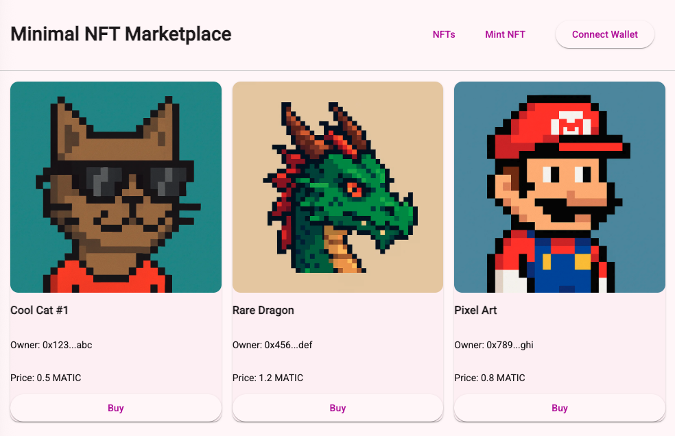
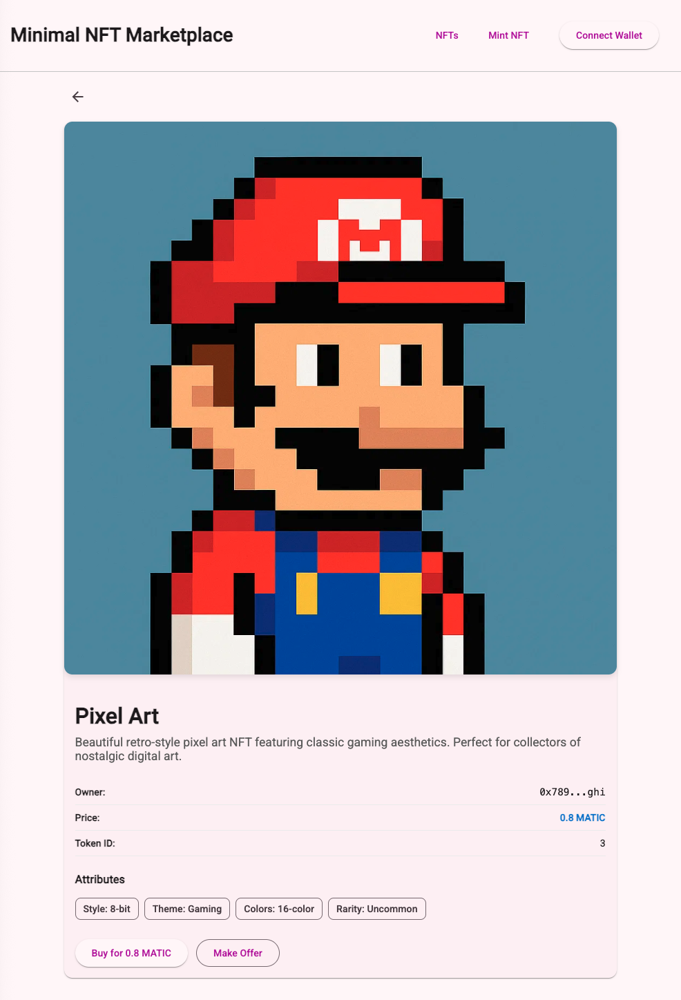
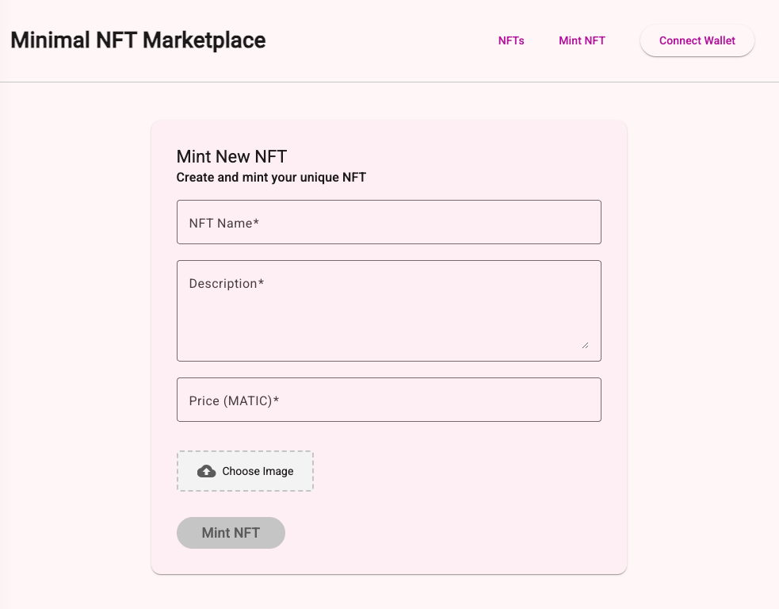

# NftMarketplace

This project was generated using Angular 20, NgRx for state management and Apollo for GraphQL.

<table>
  <tr>
    <td></td>
    <td></td>
    <td></td>
  </tr>
  <tr>
    <td align="center">NFT list</td>
    <td align="center">NFT details</td>
    <td align="center">Mint page</td>
  </tr>
</table>


## Development server

To start a local development server, run:

```bash
ng serve
```
-> `http://localhost:4200/`
automatically reloads
